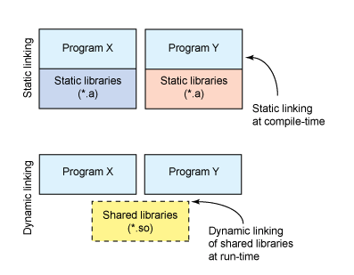
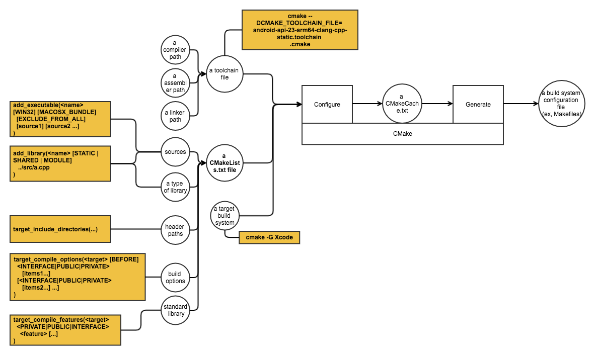
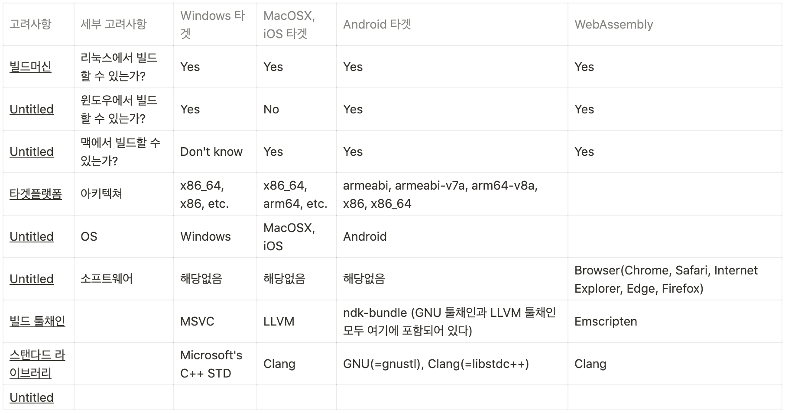

# 빌드과정, CMake, LLVM, Clang, gcc, g++, gnu emscripten, MingGW, MD/MT

실행파일 만들어지는 과정 : 컴파일 프로세스 + 링킹

오브젝트 파일 컴파일

* 그 결과물이 입력이 되어 정적 라이브러리나 실행파일 컴파일이 진행된다. 따라서 가장 기본이 되는것은

C/C++ 컴파일 과정
정적 라이브러리나 실행 파일을 빌드한다고 해도 기본적으로 오브젝트 파일부터 컴파일을 마치고

gcc실행 과정

- C/C++ 파일들 .c -> 전처리기 (preprocessor] .I ->  [C컴파일러] .s -> [어샘블러] .o -> [링커] a.out

1.전처리과정 .c, .cpp -> 전처리기 -> .i 

* 코드상단에 #으로 시작하는 전처리 부분을 처리하는 과정
* 전처리 부분에 명시된 헤더 파일 삽입, 매크로 상수 변환

2. 컴파일 과정 .i -> 컴파일러 -> .s

* 전처리된 파일 .i 를 이용하여 컴파일러가 어셈블리어 파일 .s로 변환
* 이 단계가 마지막 휴먼 리더블한 코드.
* 이 단계에서 Architecture Instruction 코드가 생성됨.
* 타겟 아키텍처에 dependant 함.

3. 어셈블 과정 .s -> 어샘블러 -> .o

* 어셈블리어로 된 .s 파일을 이진 코드로 이루어진 오브젝트 파일.o 로 생성
* Header, Text Segment, Data Segment, Relocation Info, Symbol Table, Debugging Info
오브젝트 코드는 기계가 이해할 수 있는 구조. 
* Symbol Table을 이용해서 Linking이 일어나고, Debugging Info를 이용해서 디버깅이 이루어짐 
* Symbol에 대한 정보는 Mac에서 otool 을 이용해서 확인 가능

4. 링크 과정

* 오브젝트 파일 .o는 라이브러리 함수에 해당하는 코드가 없기 때문에 실행될 수 없음
* 여러 파일로 이루어진 프로그램의 경우에도 오브젝트 파일 간 연결이 되지 않은상태
* 링커는 라이브러리 함수와 오브젝트 파일을 연결해 실행 가능한 파일로 만들어줌

정적라이브러리

* 컴파일된 오브젝트 파일들의 묶음
* 링크과정에서 정적 라이브러리를 복사해서 넣음.
* 덩치가 커지는 문제. 오브젝트 코드가 중복되어 낭비
* 한번 실행파일 생성하면 정적 라이브러리 없어도 실행파일 실행에 문제없음

동적라이브러리 (Dynamic Llink Library)

* Shared library라고도 불림 정적라이브러리의 문제 해결하기 위해 만들어짐
* 링커는 해당 동적 라이브러리가 필요하다는 정보만 기록하여둠
링크할때 라이브러리 오브젝트 파일을 실행파일로 복사하는 대신
* 이후 실행파일이 메모리에 올라가면 동적 라이브러리에 속한 함수가 필요할때 라이브러리 정보 참조해서 필요한 정보 메모리에 올림
* 이후 다른 프로그램이 실행되며 같은 라이브러리 함수 참조하고자 하면 이미 메모리에 존재하는 라이브러리 정보 참조하여 링크함

툴체인

* 개발용 프로그램 도구 집합
* 한 프로그램 출력이 다른 프로그램의 입력이 되어 서로 체인처럼 연결되어 실행됨
* 컴파일러의 출력은 어셈블러의 입력이 되고 어셈블러의 출력은 아카이버의 입력이 되고
* 링킹을 수행하는 툴체인 프로그램이 linker

컴파일러 툴체인 생산자

* GNU의 GCC, LLVM
* Frontend - 언어 해석, C,C++,Rust low 한 언어를 해석, 어휘분석 구문분석 의미분석 중간표현 생성 -> GIMPLE Tree

Middle-end - 최적화, GIMPLE Tree를 SSA(static single assignment) 형태로 변환 아키텍쳐 비종속적 최적화, RTL 생성

                      SSA 기반 최적화 - 지역 최적화, 전역 최적화, 루프 최적화 / RTL(Register Transfer Language)

Backend - 머신언어로 변환. 이때 Architecture dependent한 코드로 변환, 아키텍쳐 종속적인 최적화

                 RTL Optimizer -> Code generator . 어샘블리어로 구성된 .s 파일 생성
Frontend - Middle end (Optimization) - Backend
* LLVM은 중간과정에서 LLVM IR을 도입, 재사용이 용이한 컴파일러 구현해둠
*

6. CMake

* [https://www.tuwlab.com/ece/27234](https://www.tuwlab.com/ece/27234)
* Makefile을 보다 쉽고 편리하게 작성할 수 있는 툴
    * Makefile의 다소 지저분한 루틴들을 추상화(Abstraction)해서 보다 직관적으로 빌드 과정을 기술해주는 것
    * CMake는 Makefile을 보다 쉽게 기술해 주는 일종의 Meta-Makefile
    * CMake로 프로젝트를 관리하더라도

* CMake를 사용하면 의존성 정보를 일일이 기술해 주지 않아도 되므로 빌드 스크립트의 관리 측면에서 매우 효율적
    * CMake는 소스파일 내부까지 들여다보고 분석해서 의존성 정보를 스스로 파악함
    * Makefile에서는 빌드 중간생성물인 Object파일들의 이름과 의존성 정보까지 모두 기술해 줘야 하지만, 
    * CMake에서는 그럴 필요가 전혀 없습니다. 
    * CMake의 빌드 스크립트인 CMakeLists.txt에서는

* Build Step만 잘 구성해 놓으면, 이후에는 소스 파일(*.c)을 처음 추가할 때만 CMakeLists.txt 파일을 열어서 등록

CMake

* 이 빌드시스템이 바로 make, ninja, Visual Studio, XCode에요. 그리고 빌드시스템을 생성하는 것이 바로 “**CMake”**입니다.
특정 타겟 플랫폼에 대해서 소스를 컴파일, 패키지하고, 헤더파일 추가나 소스파일 변경을 감지하는 것이 바로

* CMakeLists.txt에서는, add_library로 내가 정한 이름으로 target 객체를 생성합니다. 그리고 이 추가된 타겟 객체에 target_compile_options, target_compile_features, target_include_directories 명령어를 호출하여 컴파일 옵션, 컴파일 기능, 그리고 헤더파일을 추가하죠.
* cmake명령어의 옵션 중 DCMAKE_TOOLCHAIN_FILE에 툴채인 파일을 넘깁니다. 마찬가지로 -G 옵션을 추가해서 빌드시스템 타입을 정의합니다. 다만 Make 빌드시스템은 기본값으로 설정되어 있어서 -G 옵션을 줄 필요가 없습니다.

컴파일 시간 (컴파일 단계)

* 컴파일 과정을 통해 컴퓨터가 인식 할 수 있는 기계어 코드로 변환되어 실행 가능한 프로그램이 되는 과정의 시간을 의미

실행 시간 (런타임 단계)

* 컴파일 과정을 마친 응용 프로그램이 사용자에 의해서 실행되어지는 ‘때’ time 을 의미

컴파일 에러

* 소스코드가 컴파일 되는 과정중에 발생하는 Syntax error, 파일 참조 오류 같은 문제들로 인해 컴파일이 방해되어 발생하는 오류
* Syntax Error, Type Check Error

런타임 에러

* 이미 컴파일이 완료되어 프로그램이 실행중임에도 불구하고, 의도치 않은 예외상황으로 인하여 프로그램 실행중에 발생하는 오류
* Divide 0, Null 참조 오류(코틀린은 null safe한 키워드 ‘?'가 있음), 메모리 부족 오류

컴파일이란?

* 작성된 소스 파일들을 특정 플랫폼(런타임)에서 이해할 수 있는 언어(일반적으로 기계어에 가까운 언어)로 변환하는 프로세스

플랫폼이란?

* 일반적으로 아키텍쳐와 그 위에 올라오는 운영체제의 쌍을 의미함
* 운영체제 위에 소프트웨어가 추가된 형태로 얘기하기도 함
* '소프트웨어 또는 라이브러리가 실행될 수 있는 환경을 위한 조건 기반 OS나 기술 환경’ 이라는 개념
* 컨텍스트에 따라 해석.

빌드란?

* 플러그인, 프레임워크, 라이브러리, SDK 등을 제작하는 프로세스. 일반적으로 컴파일 과정을 포함함
특정 플랫폼의 빌드머신에서, 타겟 플랫폼의 런타임 위에서 동작하는 프로그램이나 사용할 수 있는

크로스 플랫폼 빌드란?

* 프레임워크, 라이브러리, SDK등을 생한하는 프로세스
특정 플랫폼의 빌드머신에서 하나 이상의 다양한 타겟 플랫폼의 런타임 위에서 동작하는 프로그램이나 플러그인

C++ 크로스 플랫폼 빌드란?

* 특정 플랫폼 빌드머신에서 C++로 작성된 소스를 하나 이상의 다양한 타겟 플랫폼의 런타임 위에 설치하여 동작하는 프로그램이나 플러그인, 프레임워크, 라이브러리, SDK 등을 생산하는 프로세스.
* 고려사항
* 1. 빌드머신 또는 호스트 시스템의 플랫폼
* 2. 타겟 플랫폼 빌드 툴체인
* 예) armeabi-v7a 아키텍처에, Android OS위에 동작하는 C++ 라이브러리 빌드하려면?

어디서 빌드할것인지 정하고, Mac OS라면 mac에서 armeabi-v7a-android를 컴파일할 수 있는

 빌드 툴체인과 스텐다드 라이브러리를 지원하는지 확인. 지원하면 빌드할 수 있는것. 

Android 빌드 툴체인은 ndk-bundle 여기에 포함되어있음. GNU, LLVM 툴체인 모두 있음

스탠다드 라이브러리는 GNU(=gnustl), Clang(=libstdc++) 
3. 타겟 플랫폼 스탠다드 라이브러리

SDK란?

* Software Developer’s kit
* 소프트웨어 개발자가 특정한 소프트웨어를 개발할 수 있도록 한 개발 도구의 집합
* SDK안에는 개발에 도움이될 개발도구 프로그램, 디버깅 프로그램, 문서, API 등이 있음
* 

하지만 지금은 의미가 전용되어 API와 거의 같은 뜻으로 쓰임

API - Application Programming Interface

* 운영체제가 응용프로그램을 위해 제공하는 함수의 집합으로 응용프로그램과 디바이스를 연결해주는 역할
* 어떠한 응용프로그램에서 데이터를 주고 받기 위한 방법을 의미

RESTful 이란? - Representational State Transfer 

* 웹의 장점을 최대한 활용할 수 있는 아키텍처
* 자원 - URI, 행위 - GET, POST, PUT, DELETE, 표현 - Representations
* Create - INSERT, Read - SELECT, Update- UPDATE, Delete - DELETE ( SQL )
CRUD : 기본적인 데이터 처리 기능을 묶어서 일컫는 말 - Create, Read, Update, Delete

NDK란?

* Native Development Kit
* C와 C++ 라이브러리를 사용하여 개발할 수 있는 개발 도구

JDK란?

* Java Development Kit
* Source code가 JDK (Java Compiler)를 통해 Byte Code로 변환되고 그것이 JVM 을거치고 JRE 환경에서 동작
* Java SE (Standard Edition)
* JRE - Java Runtime Environment 자바 런타임 환경
    * JVM - Java Virtual Machine 자바 가상머신
        * 스택 머신으로 parameter나 지역 변수를 메모리 스택에 저자하고 불러오기때문에 레지스터 머신에 비해 느림
    
    *  안드로이드는 Dalvik (달빅) 가상머신
        * CPU안에 있는 레지스터를 사용하기 때문에 빠른 처리 가능
        레지스터 머신으로 parameter나 지역 변수를 레지스터에 저장하고 사용하는 개념.

Emscrypt 과정

[https://gaudiolab.com/building-native-ccwebassembly/?lang=ko](https://gaudiolab.com/building-native-ccwebassembly/?lang=ko)

LLVM(Low-Level Virtual Machine)이란? (저수준 가상머신 특별한뜻은 아님, 의미부여하지말라고 문서에써있음)

* 오픈소스 컴파일러 개발용 종합 패키지
* GCC의 고질적인 문제 해결하기 위해 탄생
* C++로 작성됨. 유지보수 편리, 컴파일 과정을 각각 독립적인 모듈로 제공
* LLVM은 기계어 생성이나 코드 최적화 등의 작업을 알아서 처리해줌
* 근래 개발된 컴파일러들은 다수가 LLVM으로 제작됨. Rust, Swift등
* Middle end에서 옵티마이징이 일어나는데 프로그래밍 언어와 기계어로 부터 완전히 독립적으로 동작함
LLVM IR (Intermediate Representation) 이라는 중간언어를 사용하고 있기 때문에 Front end - middle end - back end 과정에서

Clang(클랭)이란?

* LLVM으로 작성된 C/C++ 컴파일러
* C,C++, Objective-C, 프로그래밍 언어를 위한 컴파일러 프론트엔드
* GCC와 동등하거나 때로는 앞서는 실행, 컴파일 성능

STD ?

* C++ 스탠다드 라이브러리는 C++과 C++ ISO 표준 자체로 쓰여진 클래스들과 함수들의 집합
* STD의 특정 파트의 구현은 OS System API에 의존적일 수 밖에없음. gnustl, stdc++ 다른 벤더가 구현한 STD 라이브러리
* Extension은 ISO에서 기능확장한 표준안 발표되면 이 또한 각 벤더들이 새롭게 구현해야함. 툴체인마다 확장 기능 제공하는 수준 다름

gcc (GNU Compiler Collection) 란?

* GNU 프로젝트의 일환으로 개발되어 널리 쓰이고 있는 컴파일러
* C, Objective-C, 파스칼, 에이다 등 지원
* Linux, 윈도우 등 많은 운영체제 지원 가능 높은 호환성
* 자동 레지스터 할당, 반복적인 코드 제거, 상수 곱셈 최적화 등 최적화 수행
* **C++언어로 작성된 .cpp 파일을 GCC로 컴파일시 GCC가 .cpp 파일을 컴파일한 후 C 라이브러리로 링크하기 때문에 **

g++ (GNU C++ Compiler)

* 

C++ 언어용 컴파일러

GNU (그누) 프로젝트

* GNU는 운영체제의 하나이자 컴퓨터 소프트웨어의 모음집
*

Windows 관련

* MD, MT 옵션
    * 윈도우에서는 Standard Library가 CRT 라이브러리에 의존적인데, 
    * MD는 CRT dll라이브러리를 동적으로 링킹해서 사용하는 옵션이고, 
    * MT는 CRT lib라이브러리로 정적으로 링킹해서 사용하겠다는 것이에요.

* MD의 경우, CRT 라이브러리가 최종 바이너리에 포함되지 않기 때문에, 파일 사이즈가 작음, 시스템에 CRT dll이 없는 경우 동작안함
* MT는 라이브러리가 최종 바이너리에 포함되기 때문에 시스템과 상관없이 항상 동작함. 반면에 파일 사이즈가 큼.
* ** (MT도 마찬가지)**
***주의할 점은 MD옵션으로 빌드한 라이브러리를 사용하려면 마찬가지로 MD옵션으로 라이브러리 또는 실행프로그램을 빌드해야함**

MinGW

* Minimalist GNU for Windows의 약자로 윈도우 환경에서 GNU 툴채인을 이용하기 위한 환경
* 
* MinGW는 
* MinGW-w64는 64비트 추가지원하기위해 만든것. MinGW와는 별개의 프로젝트

Emscripten

* LLVM을 이용해서 만든 컴파일러
* Frontend는 그대로 사용하되 Optimizer와 Backend를 웹어셈블리용으로 개발한 컴파일러
* Emscripten에 포함된 웹어셈블리용 Opimizer를 Binaryen이라고 부름
* 엠스크립튼은 우선 C/C++ 소스코드를 clang+LLVM 에 던져줍니다.
* 엠스크립튼이 clang+LLVM의 컴파일 결과를 받아다가 .wasm 바이너리로 변환시켜줍니다.
* 웹어셈블리는 그 자체로는 DOM에 바로 접근할 수가 없습니다. 단지 자바스크립트를 호출하면서 정수나 부동소수점 기초 자료형을 넘겨줄 수 있을 뿐이죠. 따라서 웹 API에 접근하려면 웹 API를 호출하는 자바스크립트를 통할 필요가 있습니다. 그래서 엠스크립튼은 이걸 해주는 HTML과 자바스크립트 접착제 코드를 같이 생성해줍니다.
* emcc -s WASM=1 ./test.c -o ./test.js
